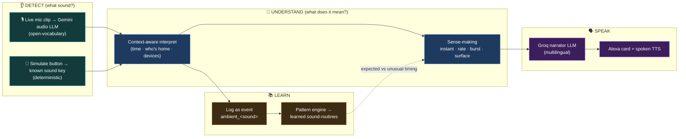
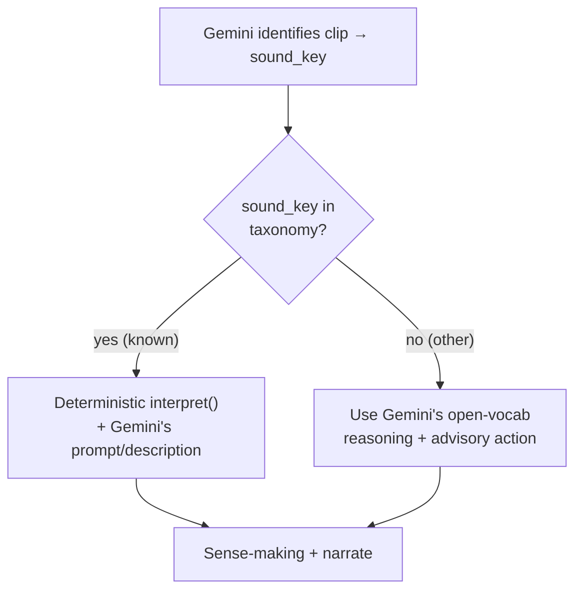
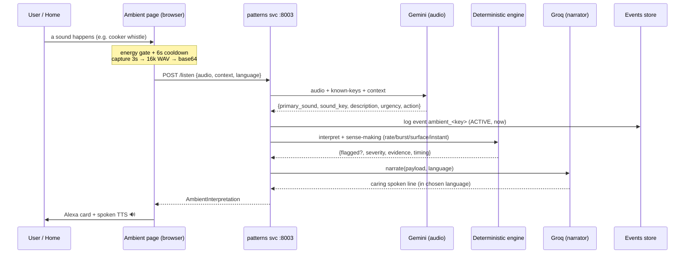
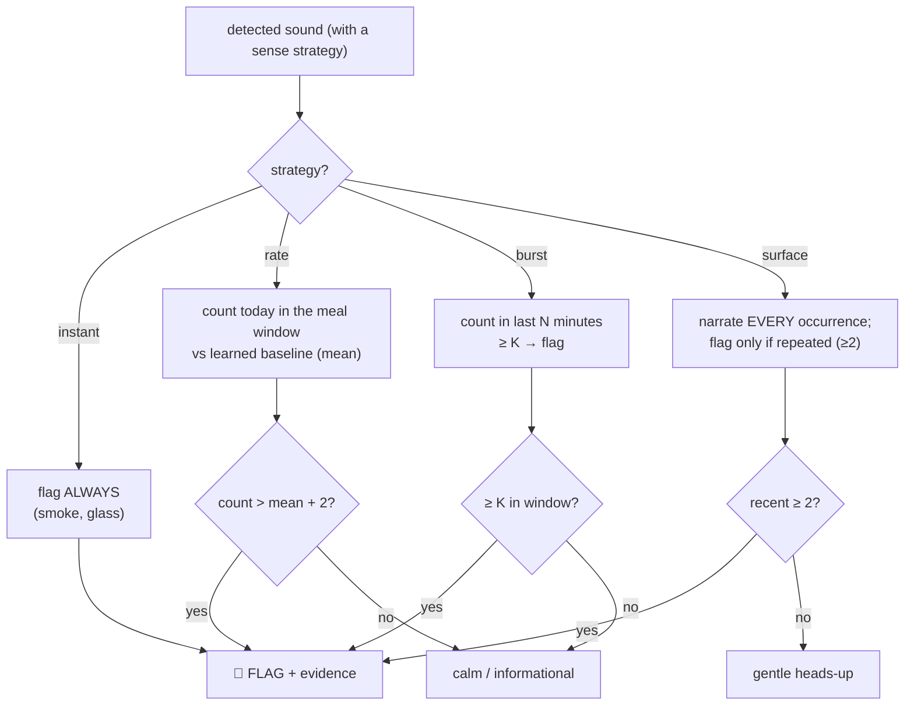
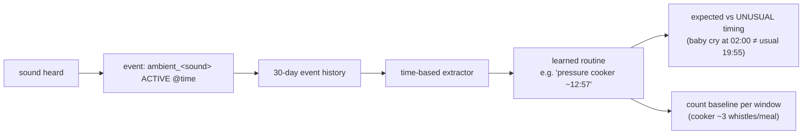
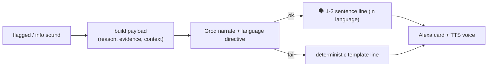
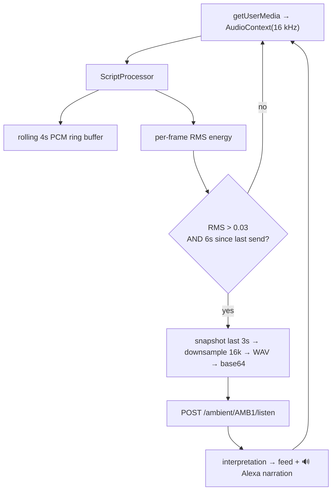

# Ambient Context — "The Household Ear"

> Feature documentation. The ambient feature lets the home **hear** everyday
> sounds, turn them into **insight** (not just a label), keep **learning sound
> routines**, and **speak up** in a caring, multilingual voice.

---

## 1 · What it is (in one picture)

The home listens, understands *what a sound means for this household*, decides
whether it's routine or a concern, and narrates it aloud.

**Core philosophy (same as the rest of Awaas AI):** detection + narration use an
LLM; the *decision of whether a sound matters* is **deterministic and
explainable**; nothing is stored, and it degrades gracefully with no LLM.

---

## 2 · The two detection paths (and the hybrid)

| | **Live mic (real audio)** | **Simulate button (fallback)** |
|---|---|---|
| Endpoint | `POST /ambient/{id}/listen` | `POST /ambient/{id}/observe` |
| Detector | **Google Gemini** audio LLM (open-vocabulary) | Direct known sound key |
| Recognises | *Any* household sound (cooker, temple bell, mixer…) | The ~15 taxonomy sounds |
| Cost | 1 Gemini call per clip (free tier, rate-limited) | Free, instant, deterministic |
| Use | Play a real sound → it's identified | Reliable stage demo, no mic/Gemini |

**The hybrid overlay:** when Gemini's `sound_key` matches a **known** taxonomy
sound, the backend overlays the *deterministic* interpreter (verified action +
expected/unusual timing) on top of Gemini's richer language. For an unknown
open-vocabulary sound, Gemini's own reasoning is used directly.

---

## 3 · End-to-end flow (live mic)

The **simulate** path is identical minus the Gemini step (the sound key is known
directly).

---

## 4 · The sound taxonomy

Defined in [`backend/patterns/logic/ambient_sounds.py`](../backend/patterns/logic/ambient_sounds.py)
as a `Sound` dataclass per entry (label, emoji, category, candidate YAMNet labels,
meaning, base severity, associated device/action, and an optional **sense**
strategy). `GET /ambient/sounds` returns it for the UI.

| Sound | Category | Sense strategy | Notable behaviour |
|---|---|---|---|
| 🚨 smoke_alarm | safety | **instant** | always alert · auto gas-off |
| 🔨 glass_break | security | **instant** | always alert · break-in framing |
| 🔔 pressure_cooker | cooking | **rate** | flag when whistles exceed the usual count/meal |
| 🤧 cough | care | **burst** | flag on ≥4 in 10 min (someone unwell) |
| 👶 baby_cry | care | **surface** | narrate every cry; flag if repeated |
| 😢 person_crying | care | — | care heads-up |
| 🔔 doorbell | security | — | visitor / delivery |
| ⏰ alarm_clock | activity | — | wake-up trigger |
| 🫖 kettle_boil | cooking | — | chai ready |
| 🚰 water_running | activity | — | tap / water waste |
| 🐶 dog_bark | security | — | disturbance / visitor |
| 📞 telephone | activity | — | phone ringing |
| 😴 snoring | comfort | — | sleep detected |
| 🧹 vacuum | activity | — | housekeeping |
| 🍽️ dishes | activity | — | kitchen activity |

Sounds without a sense strategy are still **narrated** (informational) and get
**expected/unusual timing** if a routine has been learned for them.

---

## 5 · Sense-making — turning a sound into an insight

A single sound is *data*; the insight is whether it **deviates from what's normal
for that sound**. Each sound picks one strategy
([`ambient_sense.py`](../backend/patterns/logic/ambient_sense.py)).

| Strategy | "Normal" is… | Flags when… | Example |
|---|---|---|---|
| **instant** | nothing — intrinsic | it happens at all | smoke alarm, glass break |
| **rate** | a learned **count per time-window** | today's count > mean + 2 | cooker "5 whistles vs usual 3" |
| **burst** | quiet | **K occurrences in N minutes** | 4 coughs in 10 min |
| **surface** | no schedule | narrate always; flag if repeated | baby crying |

Each flag carries **evidence** (the concrete numbers) that the narration weaves
in ("…whistled five times, more than the usual three…").

---

## 6 · Learning sound-routines (the memory loop)

Every recognised sound is logged as an **event** under a synthetic device id
`ambient_<sound>` (action `ACTIVE`, timestamped at the clock). Feeding these
through the **same deterministic pattern engine** the rest of Awaas AI uses makes
it learn *sound routines* — and count baselines that power the `rate` strategy.

- `GET /ambient/{id}/routines` returns the learned sound-routines (from
  `ambient_*` TimePatterns).
- `POST /ambient/{id}/seed` seeds 30 days of realistic ambient history
  ([`sample_data_ambient.py`](../backend/patterns/tests/sample_data_ambient.py)) —
  cooker ~3/meal, baby scattered, coughs occasional, chai/doorbell/dishes daily —
  then extracts the routines. Household **`AMB1`**.
- **Expected vs unusual timing:** when a routine exists, the interpreter marks a
  detection `expected` (on schedule) or `unusual` (off schedule → nudges severity
  for care/security sounds).

---

## 7 · Narration — the caring multilingual voice

Every recognised sound (flag **and** ordinary info) is phrased by the **Groq
narrator LLM** ([`ambient_llm.narrate`](../backend/patterns/logic/ambient_llm.py)),
1–2 natural sentences, tone matched to severity, weaving in the evidence number
for flags. It supports **7 languages** (English / Hindi / Hinglish / Tamil /
Telugu / Bengali / Marathi) via a language directive; a deterministic template is
the fallback if Groq is unreachable.

The frontend speaks it aloud through [`AlexaNotification`](../frontend/src/components/patterns/AlexaNotification.jsx)
(browser TTS, voice picked to match the language, "Why I think this" auto-expanded
on the Ambient page).

---

## 8 · The interpretation object (response)

`AmbientInterpretation` ([`models/ambient.py`](../backend/patterns/models/ambient.py))
— every field the UI uses:

| Field | Meaning |
|---|---|
| `sound`, `label`, `emoji` | canonical sound + display |
| `recognised` | was it a real household sound |
| `category`, `severity` | cooking/safety/… · info/suggest/warn/alert |
| `meaning`, `prompt` | what it is · base spoken line |
| `suggested_action` | `{device, action, requires_confirmation}` or null |
| `timing`, `routine_note` | expected / unusual / new · why |
| `flagged`, `sense_strategy`, `sense_reason`, `evidence` | sense-making verdict + numbers |
| `narration`, `narration_llm`, `explanation` | the spoken LLM line (+ was it LLM) |
| `detected_raw`, `description`, `likely_activity`, `llm_powered`, `source` | Gemini open-vocab fields (live path) |
| `confidence`, `logged` | detection confidence · was it recorded as an event |

---

## 9 · API reference

| Method | Path | Purpose |
|---|---|---|
| `GET` | `/ambient/sounds` | The taxonomy (UI mapping + simulate buttons) |
| `POST` | `/ambient/{id}/observe` | Interpret a **known** sound key (simulate/deterministic) |
| `POST` | `/ambient/{id}/listen` | Identify a **recorded clip** via Gemini, then interpret |
| `GET` | `/ambient/{id}/routines` | Learned sound-routines for the home |
| `POST` | `/ambient/{id}/seed` | Seed 30 days of ambient history + extract routines |

Common request context: `current_time`, `people_home`, `active_devices`,
`ingest`, `language`. `/listen` adds `audio_base64` + `mime_type`.

---

## 10 · Frontend — the continuous-listening pipeline

[`pages/Ambient.jsx`](../frontend/src/pages/Ambient.jsx). Hitting **Listen**
opens a continuous session that only calls Gemini when it *actually hears
something* (energy-gated) and never faster than the rate limit (cooldown).

- **Energy gate (RMS > 0.03)** → silence costs nothing.
- **6-second cooldown** → ≤ 10 Gemini calls/min (inside the free tier).
- **Simulate buttons** (grouped by category) POST `/observe` — the reliable
  fallback, same downstream pipeline.
- Live **context controls** (clock · who's home · gas on/off) feed every call.
- **Learned routines** panel + **feed** of recent detections.
- Selected **language** (sidebar) is injected into every call and the TTS.

---

## 11 · Privacy, constraints & config

- **Privacy:** only a short clip is analysed for its **sound**; nothing is
  recorded or stored, no speech is transcribed. Detection is on-demand.
- **Gemini:** model `gemini-2.5-flash` (audio-capable), key `GEMINI_API_KEY` in
  `backend/.env`. Free tier is **rate-limited** — the cooldown + simulate fallback
  keep the demo robust. *(Changing the key needs a container **recreate**, not
  just restart — docker bakes env at creation.)*
- **Whisper is NOT used here** — it's speech-to-text only and can't classify a
  cooker whistle; that's why detection uses Gemini (open-vocab audio).
- **Config** ([`patterns/app/config.py`](../backend/patterns/app/config.py)):
  `gemini_api_key`, `gemini_model`, `gemini_base_url`, `gemini_timeout_seconds`;
  Groq settings drive the narrator.

---

## 12 · Demo guide

1. Open **Ambient** → **⤵ Learn routines** (seeds AMB1 + learns sound-routines).
2. **Simulate path (reliable):** tap **🔔 Pressure cooker** ~5× (clock 13:00) →
   watch it go from calm → **flagged** ("whistled 5 times vs the usual 3"), spoken
   aloud. Tap **🤧 Cough** 4× → burst flag. **👶 Baby** once = gentle, 3× = concern.
   **🚨 Smoke** = instant alert.
3. **Live path (real audio):** hit **🎙️ Listen**, play a real cooker/temple-bell/
   doorbell clip → Gemini identifies it and it's narrated. (Needs a working Gemini
   key + `localhost`/HTTPS for the mic.)
4. **Language:** switch to **हिंदी / Hinglish** in the sidebar → the narrations
   speak in that language.
5. Set the clock to **02:00** and simulate **baby cry** → **"unusual timing"**
   (vs the learned ~19:55).

---

## 13 · File map

| Layer | File |
|---|---|
| Taxonomy + context interpret | `backend/patterns/logic/ambient_sounds.py` |
| Sense-making (instant/rate/burst/surface) | `backend/patterns/logic/ambient_sense.py` |
| Gemini detection + Groq narration | `backend/patterns/logic/ambient_llm.py` |
| Multilingual directive | `backend/patterns/logic/lang.py` |
| Models | `backend/patterns/models/ambient.py` |
| API routes | `backend/patterns/routes/ambient.py` |
| Seed data (30-day ambient history) | `backend/patterns/tests/sample_data_ambient.py` |
| Frontend page | `frontend/src/pages/Ambient.jsx` |
| Spoken narrator UI | `frontend/src/components/patterns/AlexaNotification.jsx` |
| API client | `frontend/src/patternsApi.js` (ambient*) |
