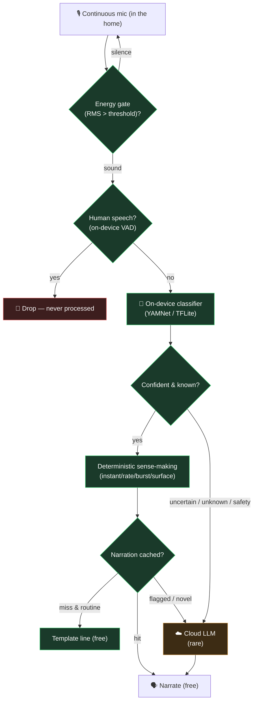

# Ambient — Scaling, Cost & Privacy (Practicality Notes)

> Design notes for the "how would this work in production?" questions about the
> [Ambient feature](AMBIENT_FEATURE.md). The current build calls a cloud LLM
> (Gemini) per detected sound clip — perfect for a demo, but not how you'd run
> it at scale. This document is the answer to two questions: **how do we keep
> API costs sustainable**, and **how do we stay private while always listening**.
>
> **Nothing here is implemented yet** — it's the production architecture we'd
> move toward. Several pieces already exist in the demo (energy gate, cooldown,
> deterministic sense-making, no storage) and are called out below.

---

## The one idea behind both answers

Both cost and privacy are solved by the **same edge-first cascade**: do the
cheap, local work first, and only escalate to the cloud for the rare sound that
is genuinely novel or worth flagging.

> **The core reframe:** cost and exposure should scale with **novelty and
> concern**, not with **sound volume**. A quiet, routine home costs almost
> nothing and sends nothing. We only spend — and only escalate — when something
> is genuinely new or worth flagging.

---

## Part 1 · Keeping API costs sustainable

The expensive thing is the cloud LLM call per clip. The fix is to stop treating
every sound as an LLM call and put cheap filters in front of it.

### 1. On-device classification as the first tier (the biggest lever)
Run a small local audio classifier (YAMNet / TensorFlow Lite — the taxonomy
already references YAMNet labels) directly in the browser/device. It's free
after load and handles the ~15 known sounds locally. Escalate to the cloud LLM
only when:
- the local model is **uncertain** (low confidence / "unknown" sound), or
- it's a **safety-critical** category (smoke, glass), or
- the user explicitly wants rich narration.

A routine home stays almost entirely on-device → near-zero cloud calls. As the
local model learns the home's sound taxonomy over time, escalations trend toward
zero.

### 2. Deduplicate & aggregate repeated sounds
A pressure cooker whistling 5× should be **one** narration ("whistled 5 times"),
not 5 calls. Count occurrences locally and call the LLM once for the aggregate.
The counting is already deterministic — just coalesce before narrating.

### 3. Cache narrations
Most narrations are templated by `(sound, severity, timing, language)`. Cache
them: "pressure cooker · expected · calm · English" is served from cache forever
after the first time. Only genuinely novel situations reach the LLM.

### 4. Deterministic-first *(already in the demo)*
The sense-making (instant / rate / burst / surface) is deterministic and free.
Only spend an LLM call when a sound is **flagged or novel**; routine sounds get
a cheap template line. The LLM is the exception, not the default.

### 5. Tiered model routing
Small/cheap model for routine narration; escalate to a larger model only for
ambiguous or safety cases (the Haiku-vs-Opus pattern).

### 6. First line of defense *(already in the demo)*
Energy gate (silence is free) + 6-second cooldown (rate cap, ≤10 calls/min).

> **Say it as:** *"We cascade — energy gate → on-device classifier →
> deterministic sense-making → cache → and only then, for the rare novel or
> flagged sound, a cloud LLM. Cost tracks anomalies, not noise."*

---

## Part 2 · Privacy while always listening

**The tension:** Alexa's "Hey Alexa" keeps audio local until you opt in — but a
cooker or a baby can't say a wake word. The insight: **the wake word isn't
really about the word, it's about keeping audio on-device until there's a reason
to escalate.** For ambient sensing you replace the *spoken keyword* trigger with
an *on-device acoustic-event* trigger. **The on-device model is the wake word.**

### 1. On-device processing is the privacy boundary
The local classifier listens continuously but only produces a **label**
("whistle", "bark") locally — raw audio never leaves the home by default. That
model is the gatekeeper: instead of a wake word triggering cloud streaming, an
*acoustic event of interest* does.

### 2. Never stream raw audio to the cloud
On the rare escalation, send the **shortest clip possible (3s)** — or better,
send only **extracted features / embeddings (a spectrogram vector), not the
waveform**. The cloud can classify from features it cannot play back as audio,
so no human-intelligible audio ever leaves the house.

### 3. Actively suppress human speech on-device (VAD)
Run voice-activity detection locally and **drop anything that's speech** — only
non-speech acoustic events get analyzed. This is the direct answer to "are you
recording my conversations?": *no — speech is filtered out before anything else
happens.* The pipeline can be structurally incapable of transcription, so it's
provably not eavesdropping.

### 4. No transcription, no storage *(already the design)*
Sound classification ≠ speech-to-text. Nothing is recorded or persisted;
detection is on-demand. A deliberate design choice, not an afterthought.

### 5. User controls & transparency
Physical mic mute, a visible indicator whenever a clip *is* escalated, on-device
by default with cloud as an explicit opt-in, and a clear log of what was sent.

> **Say it as:** *"The wake word for ambient sound is an on-device anomaly
> detector. The default state is: listening locally, sending nothing. Speech is
> filtered out before processing, and when we do escalate we send acoustic
> features — never listenable audio. Privacy and cost are solved by the same
> edge-first design."*

---

## Summary table

| Concern | Demo today | Production answer |
|---|---|---|
| Cost per sound | 1 Gemini call/clip | On-device classifier; cloud only for novel/flagged |
| Repeated sounds | multiple calls | Count locally, narrate the aggregate once |
| Routine narration | LLM call | Cache + deterministic templates (free) |
| Silence | free (energy gate) | free (energy gate) |
| Rate cap | 6s cooldown | 6s cooldown + tiered model routing |
| Raw audio to cloud | short clip sent | features/embeddings, never the waveform |
| Human speech | not transcribed | on-device VAD drops speech before processing |
| Storage | none | none |
| Wake trigger | manual / continuous | on-device acoustic-event detector = "wake word" |

---

## Related

- [AMBIENT_FEATURE.md](AMBIENT_FEATURE.md) — the feature itself
- [PATTERN_ENGINE.md](PATTERN_ENGINE.md) — the deterministic-first philosophy this reuses
