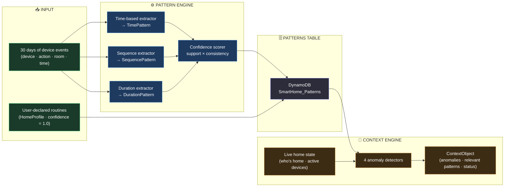
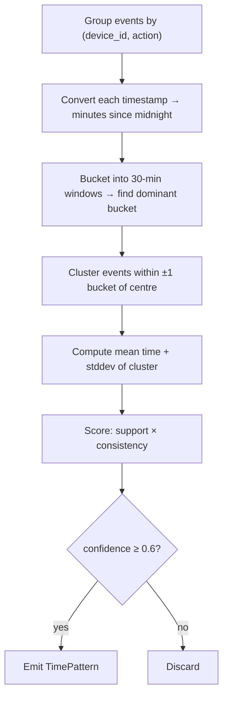
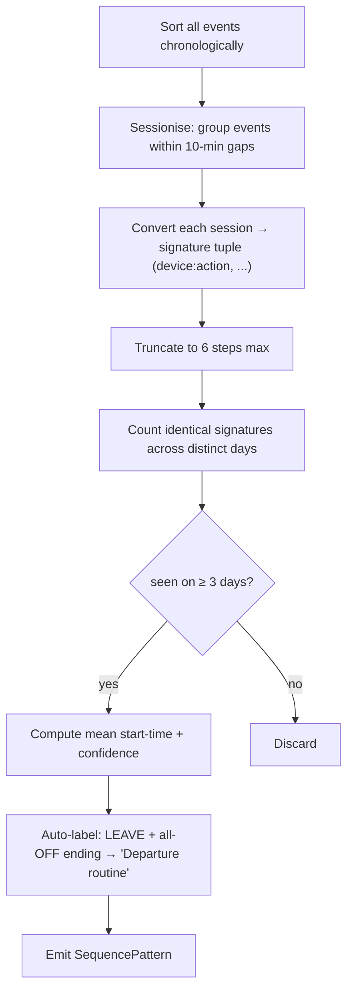
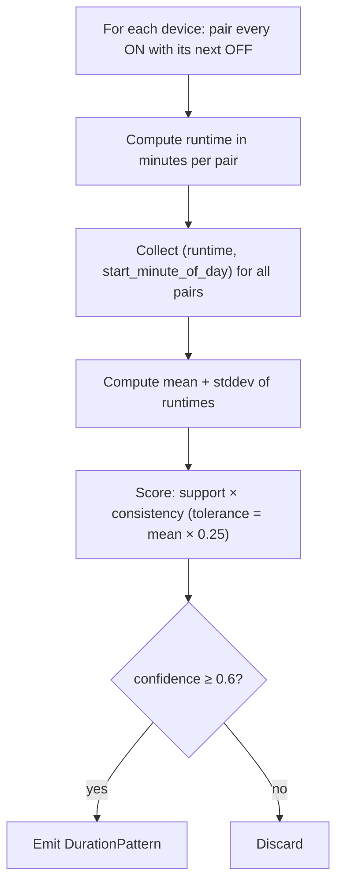
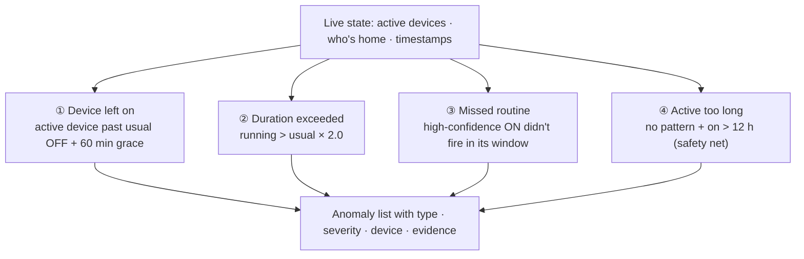
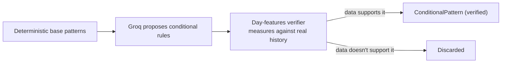
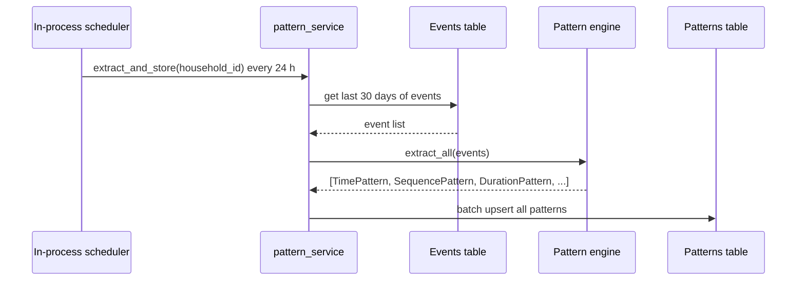

# Pattern Recognition Engine — "The Household Brain"

> Technical documentation. The pattern engine turns raw event logs into
> **explainable, deterministic routines** — no ML model, no black box. Every
> pattern has a confidence score rooted in real numbers, and every anomaly
> comes with the evidence that triggered it.

---

## 1 · What it is (in one picture)

The engine reads 30 days of device events, extracts three kinds of recurring
behaviour, scores each by evidence and regularity, then compares the live home
state against those patterns to detect anything unusual.



**Core philosophy:** no ML, no randomness, no neural weights. Every pattern is
a compact mathematical statement about recurring behaviour with two numbers
attached — how often it happens and how consistent the timing is. Every anomaly
is a concrete deviation from those numbers with the evidence stated.

---

## 2 · The event model

Everything the engine learns comes from events. An event is:

| Field | Type | Example |
|---|---|---|
| `device_id` | string | `son_room_fan` |
| `device_type` | enum | `fan · light · ac · tv · door · motor · presence · medicine` |
| `room` | string | `son_room` |
| `action` | enum | `ON · OFF · OPEN · CLOSE · ARRIVE · LEAVE · ACTIVE · TAKEN` |
| `timestamp` | ISO-8601 UTC | `2026-07-01T07:04:33Z` |
| `triggered_by` | string | `son` or `system` |

Events are stored in DynamoDB (`SmartHome_Events`) with composite sort key
`timestamp#event_id` — naturally time-ordered and unique even at millisecond
resolution. Range queries ("all events for H001 in the last 30 days") are a
single efficient DynamoDB `Query`.

---

## 3 · The three pattern extractors

### 3.1 · Time-based patterns

> *"The son's fan turns ON around 07:05 every weekday."*

**Algorithm:**



**Output fields:**

| Field | Meaning |
|---|---|
| `device` | Which device |
| `action` | `ON / OFF / OPEN / CLOSE` |
| `usual_time` | `HH:MM` mean of the cluster |
| `window_minutes` | ± tolerance (default 30 min) |
| `confidence` | 0.0 – 1.0 |
| `occurrences` | Support count over 30 days |

---

### 3.2 · Sequence patterns

> *"Door OPEN → fan OFF → light OFF every evening — that's a departure routine."*

**Algorithm:**



**Output fields:**

| Field | Meaning |
|---|---|
| `description` | Human-readable label (auto-generated or labelled) |
| `steps` | Ordered list of `device:action` strings |
| `usual_time` | When the sequence typically starts (`HH:MM`) |
| `confidence` | 0.0 – 1.0 |

---

### 3.3 · Duration patterns

> *"The water motor usually runs ~15 minutes, starting around 09:00."*

**Algorithm:**



**Output fields:**

| Field | Meaning |
|---|---|
| `device` | Which device |
| `usual_duration_minutes` | Mean runtime |
| `stddev_minutes` | Spread of runtimes |
| `usual_start_time` | When it typically turns on (`HH:MM`) |
| `confidence` | 0.0 – 1.0 |

---

## 4 · The confidence score

Every pattern gets a single confidence score in `[0.0, 1.0]`. It is the
**product** of two independent components — a pattern needs both evidence and
regularity to score high.

```
confidence = support_score × consistency_score
```

| Component | Formula | Meaning |
|---|---|---|
| **Support** | `occurrences / analysis_window_days` (capped at 1.0) | How often did it happen? 30/30 days = 1.0 |
| **Consistency** | `1 − (stddev / tolerance × 2)` (clamped to [0,1]) | How tight is the timing? |

**Examples:**

| Routine | occurrences | stddev | confidence |
|---|---|---|---|
| Fan on every day, same time | 29 / 30 | 4 min | ~0.97 |
| Fan on most days, varying time | 22 / 30 | 45 min | ~0.37 → discarded |
| Motor on every day, tight window | 30 / 30 | 2 min | ~0.99 |

Patterns below **0.6** are discarded. Missed-routine anomalies only fire for
patterns above **0.7** (high enough confidence that the absence is meaningful).

---

## 5 · User-declared routines

The engine learns from history — but users can also declare routines directly
via the **HomeProfile** panel without waiting for 30 days of data.

```
POST /profile/{household_id}/routines
{
  "label": "Morning fan",
  "device_id": "son_room_fan",
  "device_type": "fan",
  "room": "son_room",
  "action": "ON",
  "usual_time": "07:00",
  "window_minutes": 20,
  "days": ["mon", "tue", "wed", "thu", "fri"],
  "duration_minutes": 480
}
```

These are stored in `SmartHome_HomeProfiles` and converted to synthetic
`TimePattern` / `DurationPattern` objects with **`confidence = 1.0`** — the
highest possible. They are merged into `get_patterns()` alongside learned
patterns, so the anomaly engine treats them identically with no further
changes.

---

## 6 · The four anomaly detectors

Once patterns are stored, the context engine compares the live home state
against them using four deterministic detectors. All are pure functions —
same inputs always produce the same output.



| Detector | Pattern used | Threshold | Evidence in output |
|---|---|---|---|
| **Device left on** | TimePattern (OFF) | past OFF time + 60 min | "fan expected off at 08:00, still on at 09:15" |
| **Duration exceeded** | DurationPattern | actual > usual × 2.0 | "motor on 34 min, usual 15 min" |
| **Missed routine** | TimePattern (ON), confidence ≥ 0.7 | window passed + 3 h horizon | "fan usually on at 07:05, not seen today by 08:00" |
| **Active too long** | none (safety net) | on > 720 min | "door open 13 h with no learned pattern" |

---

## 7 · The context object

The output of the context engine is a `ContextObject` — a structured,
AI-ready snapshot of what is happening and why it matters. It is the handoff
point to the LLM narrator and (in the Safety feature) the Guardian.

```
ContextObject
├── context_type     NORMAL | DEPARTURE_ANOMALY | DURATION_ANOMALY |
│                    ROUTINE_SUGGESTION | CARE_ALERT | SECURITY_ALERT
├── household_id
├── current_time     "HH:MM" simulated or real clock
├── people_home      { "father": true, "son": false }
├── active_devices   [ "living_room_light", "kitchen_gas_stove" ]
├── anomalies        [ { type, device, severity, detail, evidence } ]
├── relevant_patterns  top patterns tied to the anomalies
└── recent_events    20-event tail of recent activity
```

`context_type` is classified by anomaly severity priority:
`security > care > departure > duration > routine_suggestion > normal`

---

## 8 · LLM integration (two roles)

The deterministic engine does all the detection. LLMs play two additive roles:

### 8.1 · Contextual patterns (Groq — proposal + verification)

The deterministic engine mines unconditional routines. For conditional rules
("AC only when temp > 28°C", "lights stay on later on weekends"), it asks the
Groq LLM to propose candidates — then **measures every proposal against real
event history**. Only rules the data actually supports survive.



### 8.2 · Narration (Groq — always runs)

Every anomaly is phrased by the Groq narrator into a natural, spoken-style
line in the household's chosen language. A deterministic template fires if
Groq is unreachable — the notification always shows.

---

## 9 · Scheduled extraction

The extraction job runs automatically in-process on a configurable interval
(default 24 h). It also runs on-demand via `POST /patterns/{id}/extract`.



---

## 10 · API reference

| Method | Path | Purpose |
|---|---|---|
| `POST` | `/events` | Ingest a single device event |
| `GET` | `/events?household_id=` | Query event history |
| `POST` | `/patterns/{id}/extract` | Manually trigger extraction |
| `GET` | `/patterns/{id}` | List all patterns (learned + user-declared) |
| `POST` | `/patterns/{id}/contextual` | Generate LLM-proposed conditional patterns |
| `GET` | `/context/{id}` | Generate context from live state |
| `POST` | `/context/{id}/evaluate` | Evaluate a user-supplied what-if state |
| `POST` | `/context/narrate` | Narrate a context object |
| `POST` | `/context/narrate/each` | Narrate each anomaly separately |
| `POST` | `/profile/{id}/routines` | Add a user-declared routine |
| `GET` | `/profile/{id}/routines` | List user-declared routines |
| `DELETE` | `/profile/{id}/routines/{rid}` | Remove a user-declared routine |

---

## 11 · Configuration tuning

All thresholds live in `backend/patterns/app/config.py` and are overridable
via environment variables.

| Setting | Default | Effect |
|---|---|---|
| `analysis_window_days` | 30 | Days of history analysed |
| `time_bucket_minutes` | 30 | Bucket size for time clustering |
| `min_pattern_occurrences` | 3 | Minimum days before a routine is kept |
| `min_confidence` | 0.6 | Patterns below this are discarded |
| `missed_routine_min_confidence` | 0.7 | Threshold for missed-routine alerts |
| `missed_routine_horizon_minutes` | 180 | Alert window after routine was missed |
| `departure_grace_minutes` | 60 | Grace period before device-left-on fires |
| `duration_anomaly_factor` | 2.0 | Multiplier: actual > usual × this → flag |
| `max_continuous_active_minutes` | 720 | Safety-net ceiling (12 h) |
| `extraction_interval_hours` | 24 | How often the scheduler re-learns |

---

## 12 · File map

| Layer | File |
|---|---|
| Pattern extraction orchestrator | `backend/patterns/pattern_engine/__init__.py` |
| Time-based extractor | `backend/patterns/pattern_engine/time_based.py` |
| Sequence extractor | `backend/patterns/pattern_engine/sequence_based.py` |
| Duration extractor | `backend/patterns/pattern_engine/duration.py` |
| Confidence scorer | `backend/patterns/pattern_engine/confidence.py` |
| Pattern models | `backend/patterns/models/patterns.py` |
| Event model | `backend/patterns/models/events.py` |
| User routine model | `backend/patterns/models/profile.py` |
| Context object model | `backend/patterns/models/context.py` |
| Anomaly detectors | `backend/patterns/context_builder/anomaly.py` |
| Context builder | `backend/patterns/context_builder/builder.py` |
| Pattern service (extract + store) | `backend/patterns/logic/pattern_service.py` |
| Profile service (user routines) | `backend/patterns/logic/profile_service.py` |
| Context service | `backend/patterns/logic/context_service.py` |
| Event service | `backend/patterns/logic/event_service.py` |
| LLM narrator + conditional patterns | `backend/patterns/logic/pattern_intelligence.py` |
| Config + thresholds | `backend/patterns/app/config.py` |
| DynamoDB table schemas | `backend/patterns/dynamodb/tables.py` |
