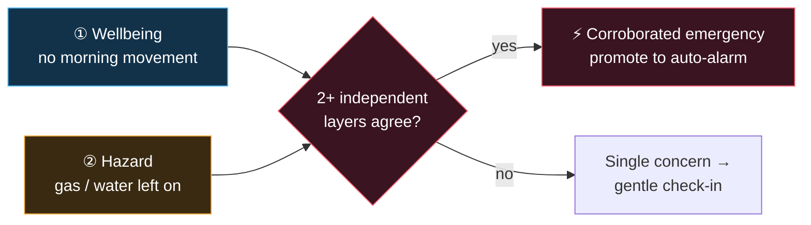
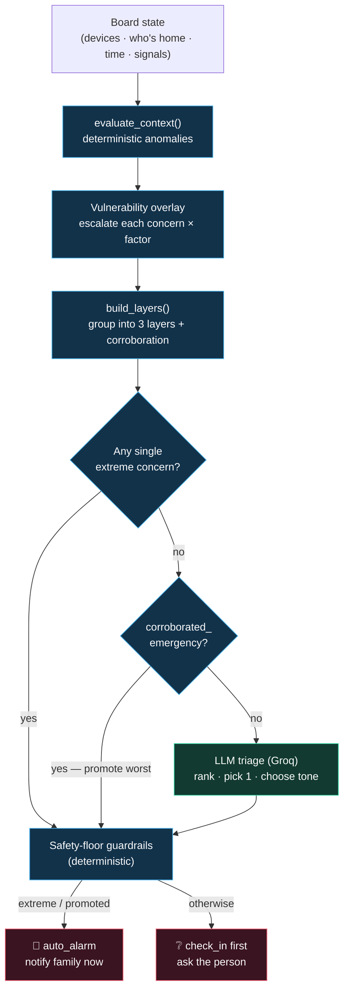
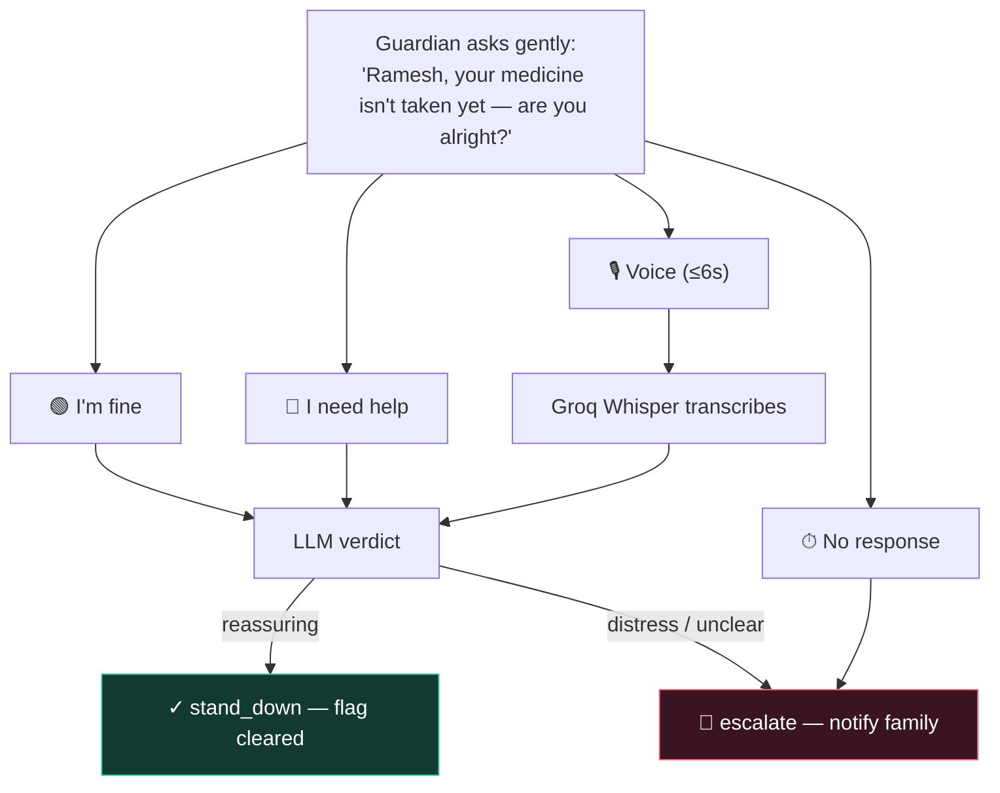

# 🛡️ The Guardian — Safety Engine Working

> **The definitive end-to-end working of the safety feature.**
> How the home watches over someone living alone, groups every signal into
> **three independent layers**, cross-checks them so one weak signal never cries
> wolf, and then decides — at the right level of urgency — whether to *ask the
> person first* or *raise the alarm now*.
>
> Companion docs: [`SAFETY_FEATURE.md`](SAFETY_FEATURE.md) (feature overview),
> [`GUARDIAN_SPEC.md`](GUARDIAN_SPEC.md) (broader product vision),
> the safety service [`README`](../backend/safety/README.md) (deployment & API).

---

## 1 · The idea in one picture

The Guardian protects a **vulnerable person who is home alone**. It reads
ordinary device activity, groups anomalies into three defense-in-depth layers,
measures how strongly those layers *agree*, and responds proportionally.

```
  SENSE            ASSESS                 3 LAYERS            DECIDE            RESPOND
 ───────    ────────────────────    ──────────────────    ───────────    ─────────────────
 devices    deterministic engine    ① Wellbeing  🚶       LLM triage      check-in first  ❔
 who's  →   anomalies + ×vuln  →     ② Hazards    🔥   →   (Groq)      →    ─ or ─
 home       overlay                  ③ Vitals     ❤️       safety floor    instant alarm   🚨
 time                                    ⚡ corroboration
```

**Core philosophy — three responsibilities, cleanly split:**

| Responsibility | Owner | Why |
|---|---|---|
| *What is true* (detection) | **Deterministic engine** | Explainable, no ML, every number auditable |
| *How to phrase & which one matters* | **LLM (Groq)** | Human judgement + a warm, caring voice |
| *The floor that can't be crossed* | **Deterministic guardrails** | An extreme concern always alarms — the LLM can never downgrade it |

There is a visual, slide-format (16:9) version of this architecture as a
[published diagram artifact](https://claude.ai/code/artifact/e5bd0db7-a5a8-4b1c-8d1c-fb4e67cbd46e).

---

## 2 · The three layers (defense-in-depth)

The heart of the engine. Every anomaly the deterministic detectors raise is
sorted into **one of three independent layers**, each catching a class of
emergency the others would miss. Defined in
[`safety/logic/safety_layers.py`](../backend/safety/logic/safety_layers.py).

| # | Layer | Icon | Watches | Catches | Hardware |
|---|-------|:----:|---------|---------|----------|
| **1** | **Wellbeing** | 🚶 | *Are they up & moving as usual?* | Silent collapse — the person stopped using the home normally | **None** — inferred from ordinary device use |
| **2** | **Home Hazards** | 🔥 | *Is the home itself safe right now?* | A dangerous **state** that could cause an emergency | Existing smart devices |
| **3** | **Vital Signs** | ❤️ | *Are they physically okay?* | Acute medical ground truth | A wearable (optional backstop) |

The mapping from anomaly type → layer (`_LAYER_OF`):

| Layer | Anomaly types |
|-------|---------------|
| **1 · Wellbeing** | `inactivity`, `global_inactivity`, `missed_routine`, `missed_medicine`, `missed_arrival` |
| **2 · Hazard** | `device_left_on`, `duration_exceeded`, `device_active_too_long`, `unsafe_at_night`, `unexpected_activity` |
| **3 · Vitals** | `health_alert`, `sos` |

> **Why this matters for the pitch:** Layers 1 & 2 need **no new hardware** —
> wellbeing and hazards are inferred from the devices a home already has. The
> wearable (Layer 3) is a high-confidence backstop, never a requirement.

Each layer rolls up to a `SafetyLayer` with its worst severity, a concern count,
and the human detail of its most severe concern — this is exactly what the
frontend `LayerBoard` renders live.

---

## 3 · Cross-layer corroboration (the crux)

One weak signal shouldn't wake the family. But **weak signals from independent
layers that agree are almost certainly real.** So the engine measures agreement
across layers and raises confidence — and urgency — when more than one lights up.



**The corroboration score** (0–1), computed in `build_layers()`:

```
corroboration = min(1.0, 0.34 × active_layers + 0.08 × worst_severity_rank)
corroborated  = active_layers ≥ 2
```

**The multi-layer payoff** — the rule that makes the whole thing worth building:

```
corroborated_emergency = (Wellbeing AND Hazard)
                         OR (Vitals AND (Wellbeing OR Hazard))
```

A **no-movement + gas-left-on** combination is treated as an **emergency even
though neither concern alone is extreme.** Neither would alarm on its own; the
fact that two independent layers point the same way is what raises it.

---

## 4 · End-to-end pipeline

What happens on every `POST /guardian/{id}/assess`:



Key point: the LLM triage sits **inside** a deterministic sandwich. Whatever it
proposes, the safety floor has the final say on anything extreme or corroborated.

---

## 5 · Vulnerability overlay

Before layering, every concern's severity is escalated by **who is home**. The
same open window is `low` for a fit adult but `critical` for an elderly person
alone. Weights live in [`app/config.py`](../backend/safety/app/config.py).

| Person type | Factor | Example (E001 roster) |
|---|:---:|---|
| Elderly | **×2.0** | Ramesh 👴 · Saroja 👵 |
| Pregnant | ×1.8 | Meera 🤰 |
| Unwell / recovering | ×1.8 | Ravi 🤒 |
| Child | ×1.7 | Aarav 🧒 |
| Normal adult | ×1.0 | Arjun 🧑 |
| Capable adult present | ×0.6 | *mitigates the heightened watch* |

- **Most-vulnerable wins** — the home's factor is the max over everyone home.
- **Supervised mitigation** — a capable adult present multiplies by `0.6`.
- **Vulnerable-alone** — a non-normal person with no capable adult → every
  concern fully escalated, and the Guardian enters *heightened vigilance*.

`escalated_rank = round(base_rank × factor)`, clamped to `[0,4]` →
`low / medium / high / critical`. Each concern keeps its `base_severity` and
`vulnerability_factor`, so the UI can show `medium → critical · ×2.0`.

---

## 6 · The Guardian decision

### 6.1 · What counts as "extreme"

Extreme concerns skip the check-in and alarm immediately. Crucially this keys on
the **type** of emergency, **not raw severity** — because the ×2.0 elderly
escalation would push almost everything to "critical" and leave nothing to check
in about. From [`guardian.py`](../backend/safety/logic/guardian.py) `_is_extreme`:

| Extreme when… | Rationale |
|---|---|
| type ∈ {`sos`, `health_alert`, `global_inactivity`} | A fall, abnormal vitals, or a very long total silence |
| type = `unsafe_at_night` | An open door/window overnight for someone vulnerable alone |
| gas/stove device + {`duration_exceeded`, `device_active_too_long`, `device_left_on`} | A burning stove is a fire hazard |
| **corroborated_emergency** (§3) | Two independent layers agreeing, even if no single concern is extreme |

### 6.2 · LLM triage (Groq)

The triage prompt (`TRIAGE_SYSTEM`) asks the model to:

1. **Rank** every open concern by real danger to the person.
2. **Pick the single most dangerous + relevant** one to act on now.
3. **Choose the response and match its tone** — the three levels must *feel*
   different:
   - `check_in` → **warm, gentle nudge** (missed routine) — "probably fine, just checking."
   - `auto_alarm` (hazard) → **firm, serious** — names the danger, states the action.
   - `auto_alarm` (medical/SOS) → **gravest urgency** — immediate, decisive.
4. Write the `spoken` line, `checkin_prompt`, a warm **`explanation`** ("why this
   matters for THIS person right now"), and a `family_message`.

When layers corroborate, the triage payload includes `independent_layers_agree`
with the engine's headline, and the prompt tells the model to say the signs agree
("no movement from Ramesh **AND** the gas left burning").

### 6.3 · Safety-floor guardrails (deterministic)

The LLM proposes; these rules dispose. **The LLM can never cross the floor:**

- An **extreme** (or corroboration-promoted) concern **always** `auto_alarm`s and
  notifies family — regardless of what the LLM returned.
- Everything else → **`check_in` first**, family notified only *after* the reply.
- If Groq is unavailable, deterministic level-aware fallbacks produce the same
  shape (spoken line + `explanation`), so the Guardian never blocks.

The `llm_powered` flag records whether Groq phrased the line (UI shows
🧠 *spoken by Alexa* vs *template*). `corroboration_promoted` records when
corroboration — not a single extreme concern — raised the alarm (UI shows the
"⚡ Neither signal alone was an emergency" callout).

---

## 7 · The check-in loop

When the Guardian checks in first, the person replies by **voice or tap**, and a
second LLM pass (`CHECKIN_SYSTEM`) returns a verdict.



**Deterministic floor on the reply (LLM cannot override):**

- **Silence / empty reply** → always `escalate`.
- **Distress keywords** (`help`, `fallen`, `hurt`, `chest`, `bachao`, `madad`, …,
  across all 7 languages) → always `escalate`.
- Otherwise the LLM decides `stand_down` vs `escalate`, with a warm `explanation`.

---

## 8 · Worked example — the corroboration save

The scenario that proves the whole design (and the recommended demo climax):

| Step | State | Layers active | Guardian |
|---|---|---|---|
| 1 | Ramesh misses his morning medicine | ① Wellbeing (high) | ❔ **Gentle check-in** — "probably nothing, just asking" |
| 2 | …and the **water motor** is left running | ① Wellbeing + ② Hazard | 🚨 **Auto-alarm** — *corroboration promoted* |

Neither signal alone is an emergency — a running motor is trivial, a late
medicine is mild. But **no movement AND the home misbehaving** is exactly the
signature of a silent collapse, so two independent layers agreeing raises the
alarm. `decision.corroboration_promoted == True`, and the UI shows:

> ⚡ **Neither signal alone was an emergency** — two independent layers agreeing
> is what raised this alarm. That's the point of defense-in-depth.

> ⚠️ **Demo note:** for the corroboration story pick the **water motor**, not
> gas — gas is inherently extreme (`_is_extreme`) and auto-alarms on its own,
> which hides the corroboration effect. Use gas separately to show the hard
> safety floor the LLM can't override.

---

## 9 · The interactive demo (frontend)

[`frontend/src/pages/Safety.jsx`](../frontend/src/pages/Safety.jsx) is a guided,
choice-driven storyboard — every scene calls the **real** backend, nothing is
scripted.

| Stage | UI | Drives |
|---|---|---|
| **Intro** | Who's-home picker (full roster) | The vulnerability factor for the run |
| **Layer 1** | The learned morning routine — tap the step he *missed* | A real `missed_routine` → gentle check-in (reply by 🎙️ voice / tap) |
| **Layer 2** | Hazard picker (gas / water / door / window) | Corroborates the open wellbeing concern → escalation |
| **Layer 3** | The 🆘 SOS button | Instant alarm — the gravest tone |
| **Always** | Time-of-day slider (`ClockBar`) | Re-runs live; an open window becomes a *night security emergency* |

Live UI reflections of the engine (all fed from the real `GuardianDecision`):

- **`LayerBoard`** — three chips mirror each layer's severity + concern count; a
  pulsing **＋** connects two lit layers; a **corroboration meter** shows the
  engine's `corroboration` score (0–100%) and `headline` verbatim.
- **`StillOpen`** — carry-forward chips ("🪔 pooja still missed", "🚰 water still
  running") show *why* the layers corroborate.
- **`TriageChips`** — "N concerns → acted on 1", "medium → critical ×2.0".
- **`WhyBlock`** — the LLM's genuine "🧠 Why I think this" reasoning, per response.
- **Finish** — recaps the actual run per layer: gentle check-in → ⚡ corroborated
  alarm → instant alarm.

---

## 10 · Data shapes

`GuardianDecision` ([`models/guardian.py`](../backend/safety/models/guardian.py)):

| Field | Meaning |
|---|---|
| `mode` | `all_clear` · `check_in` · `auto_alarm` |
| `posture` | `safe` · `watchful` · `concern` · `emergency` |
| `flagged` | the single `GuardianConcern` surfaced now |
| `all_concerns` | every concern raised (for the "N → 1" chip) |
| `spoken` / `checkin_prompt` | the Alexa line / the gentle question |
| `explanation` | the LLM's "why I think this" |
| `layers` | `LayeredAssessment` — the three-layer view + corroboration |
| `corroboration_promoted` | corroboration (not a single extreme) raised the alarm |
| `llm_powered` | Groq phrased it (vs deterministic fallback) |
| `notify_family` / `family_message` | escalation payload |

`LayeredAssessment` ([`models/safety.py`](../backend/safety/models/safety.py)):
`layers[]` (per-layer `SafetyLayer`), `active_layers`, `corroboration` (0–1),
`corroborated`, `corroborated_emergency`, `headline`.

---

## 11 · API

| Method | Path | Purpose |
|---|---|---|
| `POST` | `/guardian/{id}/assess` | Run the full assessment on a board state → `GuardianDecision` |
| `POST` | `/guardian/{id}/checkin/respond` | Submit a check-in reply (text or `audio_base64` webm) → `CheckinVerdict` |
| `POST` | `/context/{id}/evaluate` | Raw deterministic assessment (no Guardian triage) |
| `POST` | `/admin/seed/{id}?scenario=` | Seed 30 days of history + a today scenario |

`assess` body mirrors `EvaluateStateRequest`: `current_time`, `active_devices`,
`device_on_since`, `people_home`, `profiles` (with vulnerability), `signals`
(wearable events), `language`, plus the determinism controls
`ignore_stored_events`, `healthy_baseline`, `skip_completions`.

---

## 12 · File map

| Concern | File |
|---|---|
| Three-layer grouping + corroboration | [`backend/safety/logic/safety_layers.py`](../backend/safety/logic/safety_layers.py) |
| Guardian triage + check-in + Whisper | [`backend/safety/logic/guardian.py`](../backend/safety/logic/guardian.py) |
| Guardian / decision models | [`backend/safety/models/guardian.py`](../backend/safety/models/guardian.py) |
| Layer / assessment models | [`backend/safety/models/safety.py`](../backend/safety/models/safety.py) |
| Guardian API routes | [`backend/safety/routes/guardian.py`](../backend/safety/routes/guardian.py) |
| Vulnerability overlay | [`backend/safety/context_builder/safety_overlay.py`](../backend/safety/context_builder/safety_overlay.py) |
| Elderly seed data (E001) | [`backend/safety/tests/sample_data_elderly.py`](../backend/safety/tests/sample_data_elderly.py) |
| Interactive storyboard UI | [`frontend/src/pages/Safety.jsx`](../frontend/src/pages/Safety.jsx) |
| API client | [`frontend/src/safetyApi.js`](../frontend/src/safetyApi.js) |

---

## 13 · Tests

| File | Covers |
|---|---|
| [`safety/tests/test_safety.py`](../backend/safety/tests/test_safety.py) | Routine learning, vulnerability resolution, severity escalation, SOS emergency, calm baseline |
| [`safety/tests/test_guardian_layers.py`](../backend/safety/tests/test_guardian_layers.py) | Layer grouping & corroboration; the promotion guardrail (wellbeing + hazard → auto-alarm); uncorroborated → check-in first |

```bash
cd backend && PYTHONPATH=. python -m pytest safety/tests/ -q
```

> The pure-logic tests need no AWS. See the note in the safety
> [`README`](../backend/safety/README.md) on running the moto-backed integration
> tests locally.
