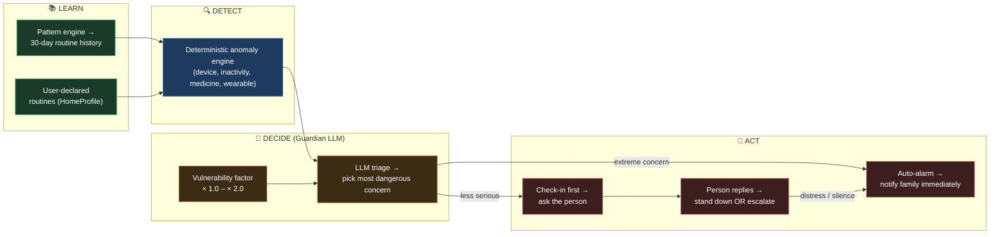
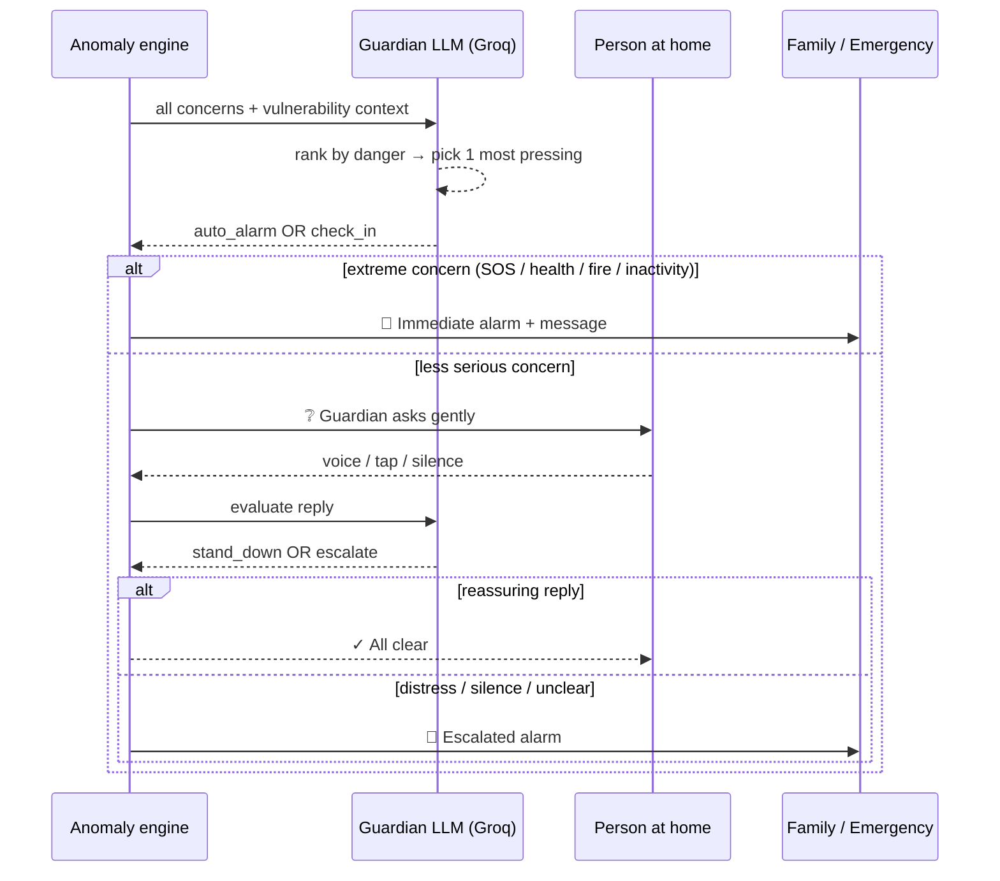
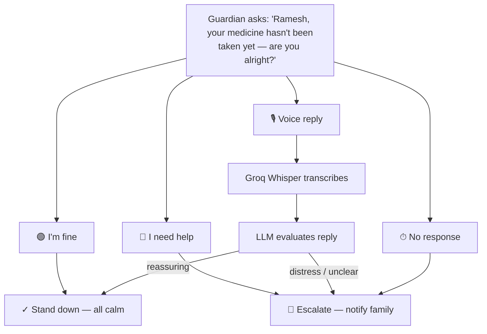

# Safety — "The Guardian"

> Feature documentation. The safety feature gives the home the ability to
> **watch over vulnerable people**, **decide what matters**, and **act at the
> right level of urgency** — checking in before alarming, or raising an
> immediate alarm when there's no time to ask.

---

## 1 · What it is (in one picture)

The home learns a person's daily routine, detects when something breaks it,
weighs the concern against who is home and how vulnerable they are, and then
either asks the person first or notifies the family immediately.



**Core philosophy:** detection is deterministic and explainable; the *decision
of how seriously to treat a concern* is made by an LLM with clear safety
instructions; the *escalation floor* (extreme concerns always auto-alarm,
silence always escalates) is deterministic and the LLM cannot override it.

---

## 2 · The two-layer architecture

### Layer 1 — Deterministic Safety Engine

Reuses the same pattern engine as the rest of Awaas AI. It learns 30 days of
household routines and at any moment runs four anomaly detectors:

| Detector | Fires when… |
|---|---|
| **Device left on** | Active device is past its usual OFF time + grace window |
| **Duration exceeded** | Device running > usual duration × 2.0 |
| **Missed routine** | High-confidence ON routine passed its window without firing |
| **Active too long** | No learned pattern, but device on > 12 hours (safety net) |

Plus safety-specific signals from wearables and sensors:

| Signal | Severity |
|---|---|
| SOS from wearable | Critical |
| Abnormal heart rate | Critical |
| No movement (5 h) | High |
| Gas stove on > 60 min | High |
| Window open at night | Medium |
| Missed medicine | Medium |

Each concern carries a **base severity** that is then multiplied by the
**vulnerability factor** of whoever is home alone (see §3).

---

### Layer 2 — The Guardian (LLM triage + check-in)

The Guardian receives all raised concerns and makes the human judgement the
deterministic engine cannot: *is this worth waking the family, or should I
ask first?*



**Safety floor rules (deterministic — LLM cannot override):**
- An extreme concern **always** auto-alarms, regardless of LLM output
- Silence after a check-in **always** escalates
- Distress keywords (`help`, `fallen`, `hurt`, `bachao`, `madad`, …) **always** escalate

---

## 3 · Vulnerability factors

Every person in the household carries a vulnerability factor. When a
vulnerable person is home alone, every concern's effective severity is
multiplied by their factor — the same gas stove concern is treated
fundamentally differently depending on who is home.

| Person type | Factor | Example occupant |
|---|---|---|
| Elderly | ×2.0 | Ramesh (👴), Saroja (👵) |
| Pregnant | ×1.8 | Meera (🤰) |
| Unwell / Recovering | ×1.8 | Ravi (🤒) |
| Child | ×1.7 | Aarav (🧒) |
| Normal adult | ×1.0 | Arjun (🧑) |

When a **capable adult (×1.0) is present**, the Guardian's heightened watch
is suspended — a capable adult can handle the situation.

---

## 4 · What triggers auto-alarm vs. check-in

| Concern type | Response | Reason |
|---|---|---|
| SOS signal | Auto-alarm | Explicit distress call |
| Abnormal heart rate | Auto-alarm | Medical emergency, no time to ask |
| No movement (5 h) | Auto-alarm | Could be unconscious |
| Gas stove on > 60 min + elderly alone | Auto-alarm | Fire hazard |
| Missed medicine | Check-in first | Could be a deliberate delay |
| Window open at night | Check-in first | Could be intentional for air |
| Unexpected inactivity (shorter) | Check-in first | Could be sleeping or reading |

The LLM triage step picks the **single most dangerous concern** from all
raised flags and determines the response mode for it. The triage result is
shown transparently in the UI — every concern is listed, with the most
pressing one marked.

---

## 5 · The check-in flow

When the Guardian decides to check-in first, it speaks a gentle, contextual
question to the person. They can reply in three ways:

1. **Tap** — preset buttons: "I'm fine" (stand down) or "I need help" (escalate)
2. **Voice** — up to 6 seconds, transcribed by Groq Whisper, evaluated by LLM
3. **No response** — treated as distress, escalates after timeout



---

## 6 · Routine learning + user-declared routines

The safety engine knows what is *normal* for this household through two
sources:

**Learned patterns** — 30 days of event history fed through the pattern engine
produces time, sequence, and duration patterns for each person's daily routine.
`POST /admin/seed/E001` seeds the demo household with realistic data.

**User-declared routines** — via the [HomeProfile](../frontend/src/components/patterns/HomeProfile.jsx)
panel (`POST /profile/{id}/routines`), family members can directly declare
schedules (device, action, time, days) without waiting for history to
accumulate. These are injected as synthetic patterns with `confidence = 1.0`
and are monitored identically to learned ones.

---

## 7 · Multilingual protection

Every Guardian message — the check-in question, the alarm line, the family
notification — is generated in the household's selected language via the Groq
narrator. Distress keyword detection covers all 7 supported languages.

| Language | Code |
|---|---|
| English | `en` |
| Hindi | `hi` |
| Hinglish | `hinglish` |
| Tamil | `ta` |
| Telugu | `te` |
| Bengali | `bn` |
| Marathi | `mr` |

---

## 8 · API reference

| Method | Path | Purpose |
|---|---|---|
| `POST` | `/guardian/{id}/assess` | Run Guardian triage on a board state |
| `POST` | `/guardian/{id}/checkin/respond` | Submit a check-in reply (text or audio) |
| `POST` | `/context/{id}/evaluate` | Raw deterministic safety assessment |
| `POST` | `/admin/seed/{id}?scenario=` | Seed demo scenarios (see §9) |
| `POST` | `/admin/profiles/{id}?preset=` | Swap household composition preset |

**Guardian assess request** — same shape as `EvaluateStateRequest`:
`current_time`, `active_devices`, `device_on_since`, `people_home`,
`profiles` (with vulnerability), `signals` (wearable events), `language`.

**Check-in respond body:**
```json
{
  "text": "I'm fine, just forgot",
  "audio_base64": null,
  "person": "Ramesh",
  "concern_detail": "Morning medicine not yet taken at 10:30",
  "language": "en"
}
```

---

## 9 · Demo scenarios (household E001)

Household **E001** is an elderly couple: **Ramesh** (👴 ×2.0) and **Saroja** (👵 ×2.0).
Seed 30 days of realistic routine history with `POST /admin/seed/E001`.

| Quick button | Scenario key | Guardian response |
|---|---|---|
| Normal | `normal` | All clear |
| 💊 Missed medicine | `missed_med` | Check-in first |
| 🔥 Gas left on | `gas` | Auto-alarm (fire hazard) |
| 🌙 Window open at night | `window_night` | Check-in first |
| 🟡 No movement (5 h) | `inactivity` | Auto-alarm |
| 🆘 SOS | `sos` | Auto-alarm (immediate) |
| 🫀 Abnormal heart rate | `health` | Auto-alarm (immediate) |

**Household presets** (`POST /admin/profiles/E001?preset=`):

| Preset | Who's home | Vulnerability |
|---|---|---|
| `elderly` | Ramesh + Saroja | Both ×2.0 |
| `child_alone` | Aarav | ×1.7 |
| `pregnant_alone` | Meera | ×1.8 |
| `unwell_alone` | Ravi | ×1.8 |
| `mixed_support` | Saroja + Arjun | Elderly + capable adult |

---

## 10 · Demo guide

1. Open **Safety** → place only **Ramesh** home → note ⚠ vulnerable alone warning
2. Click **💊 Missed medicine** → Guardian check-in appears → tap **I'm fine** → stand down
3. Click **💊 Missed medicine** again → tap **⏱ No response** → family escalation fires
4. Click **🔥 Gas left on** → watch auto-alarm trigger with no check-in offered
5. Click **🆘 SOS** → instant red emergency state, score drops to near 0
6. Add **Arjun** home alongside Ramesh → heightened watch suspends, score recovers
7. Switch language to **हिंदी** → repeat any scenario → Guardian speaks in Hindi

---

## 11 · File map

| Layer | File |
|---|---|
| Guardian triage + check-in LLM | `backend/safety/logic/guardian.py` |
| Guardian models | `backend/safety/models/guardian.py` |
| Guardian API routes | `backend/safety/routes/guardian.py` |
| Core safety anomaly overlay | `backend/patterns/context_builder/safety_overlay.py` |
| Seed data (E001 elderly) | `backend/safety/tests/sample_data_elderly.py` |
| Frontend Safety page | `frontend/src/pages/Safety.jsx` |
| Guardian UI panel | `frontend/src/components/patterns/GuardianPanel.jsx` |
| API client | `frontend/src/safetyApi.js` |
| User-declared routines | `frontend/src/components/patterns/HomeProfile.jsx` |
